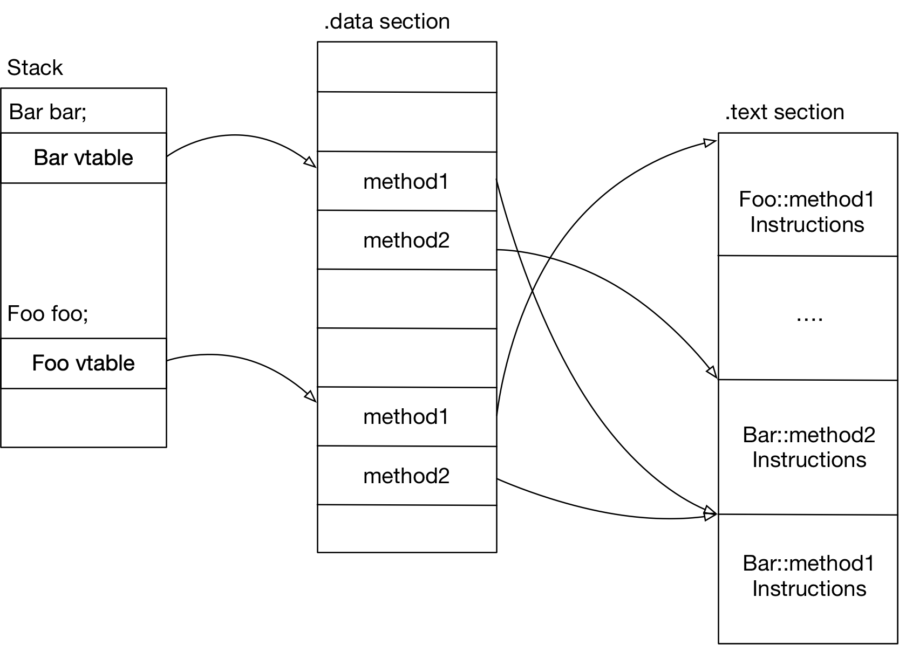

[tl;dr](#summary)

For simplicity, part 1 only discusses how vtable works with __single-inheritance__. Part 2 will come soon to cover how vtable works with multi-inheritance. Also, I assume the inheritance is done through virtual functions not the static shadowing.

We all know virtual function call cannot be inlined and it has overhead of runtime table looking up. But how it's implemented?

Reading high-level C/C++ code won't give us any hints about the underlying implementation. In most cases, we can have a better understanding from low level assembly code since it's very close to how machine understands the high level concept.

Through this post, I will use this high level Cpp code [demo.cc][compiler-explorer] for demonstration:

```cpp
#include <cstdio>

struct Bar {
    virtual void method1() {
        std::puts("method1: this is bar");
    }

    virtual void method2() {
        std::puts("method2: this is bar");
    }
    virtual ~Bar() {};
};

struct Foo: public Bar {
    virtual void method1() {
        std::puts("method1: hi, I'm foo");
    }
    virtual ~Foo() {};
};

int main() {
    Bar bar;
    Foo foo;
    Bar* bar_arr[2];
    bar_arr[0] = &bar;
    bar_arr[1] = dynamic_cast<Bar*>(&foo);

    for (auto ptr: bar_arr) {
        ptr->method1();
        ptr->method2();
    }
    return 0;
}
```

## C++ memory layout

First, let's understand the C++ memory layout or how object is represented in C++.
<a name="layout-dump"></a>
```bash
$ clang -cc1 -std=c++11 -fdump-record-layouts demo.cc
... # ignore the error if you see any
*** Dumping AST Record Layout
         0 | struct Bar
         0 |   (Bar vtable pointer)
           | [sizeof=8, dsize=8, align=8,
           |  nvsize=8, nvalign=8]

*** Dumping AST Record Layout
         0 | struct Foo
         0 |   struct Bar (primary base)
         0 |     (Bar vtable pointer)
           | [sizeof=8, dsize=8, align=8,
           |  nvsize=8, nvalign=8]
```

`0` on the left of the pipe means the offset from the object memory address. We can infer the size of the vtable pointer is 8 from `sizeof` because it starts at 0 and the total size of object is 8 bytes.

As the above output shows, the instance of struct `Bar` and `Foo` only contains a pointer inside. So the `sizeof(bar)` and `sizeof(foo)` should be 8 on 64 bits machine.

For single-instance, we only need to know `sizeof`, `dsize` and `align`.

### nvsize (optional)

Feel free to skip this section.

Here, `dsize` means object size without trailing alignment. What about `nvsize`? [nvsize][nvsize-abi] simply means the size of non-pure-virtual part.

Let's check a __modified__ code example from [pure virtual inheritance wiki][pure-virtual-class]:

```cpp
// wiki.cc
struct A {
    virtual ~A() = default;
    int aa; // demo purpose, add non-vtable-pointer memory to A
    virtual void a_a() {}
};

struct B: virtual A {
    virtual void b_b() {}
};

struct C: virtual A {
    virtual void c_c() {}
};

struct D: B, C {};

int main() {
  return sizeof(D);
}
```

Below is a virtualization of the inheritance hierarchy,


It's possible to infer the same graphical information from the memory layout output by compiler frontend too.

```c
$ clang -cc1 -std=c++11 -fdump-record-layouts wiki.cc
*** Dumping AST Record Layout
         0 | struct A
         0 |   (A vtable pointer)
         8 |   int aa
           | [sizeof=16, dsize=12, align=8,
           |  nvsize=12, nvalign=8]

*** Dumping AST Record Layout
         0 | struct B
         0 |   (B vtable pointer)
         8 |   struct A (virtual base)
         8 |     (A vtable pointer)
        16 |     int aa
           | [sizeof=24, dsize=20, align=8,
           |  nvsize=8, nvalign=8]

// omit C, which is same as B

*** Dumping AST Record Layout
         0 | struct D
         0 |   struct B (primary base)
         0 |     (B vtable pointer)
         8 |   struct C (base)
         8 |     (C vtable pointer)
        16 |   struct A (virtual base)
        16 |     (A vtable pointer)
        24 |     int aa
           | [sizeof=32, dsize=28, align=8,
           |  nvsize=16, nvalign=8]
```

As you can see the layout of struct `D`, it has `3` vtable pointers, namely, `B`'s vtable pointer at offset 0, `C` at 8, and `A`'s at 24. So the `dsize` is `3 * 8 + sizeof(int)`, 28. The final vtable generated by compiler for `D` is quite complex and we won't cover that in part 1.

Back to the point, the `nvsize` of `D` is the sum of `nvsize` of `B` (8 bytes, a vtable pointer) and `C` (8 bytes, a vtable pointer), without virtual base `A` taken into account because `D` only has __one__ `A` instance along the inheritance hierarchy. Thus, the `dsize` is `nvsize` of `D` plus one `A`'s `nvsize`.

In general, the virtual inheritance vtable implementation is quite complicated. You can try to remove `int aa;` line from the pure virtual base `A`. The result is quite surprising.

---

## Assembly code for vtable implementation

Here's an [code example][compiler-explorer] of how vtable is implemented in assembly code level. Below is using [GNU assembler directives](https://ftp.gnu.org/old-gnu/Manuals/gas-2.9.1/html_chapter/as_7.html) for vtable declaration: <a name="vtable-layout"></a>

```c
vtable for Foo:
        .quad   0
        .quad   typeinfo for Foo    // RTTI for foo
        .quad   Foo::method1()      // where vtable starts
        .quad   Bar::method2()      // for method2 in vtable
        .quad   Foo::~Foo() [complete object destructor]
        .quad   Foo::~Foo() [deleting destructor]
vtable for Bar:
        .quad   0   // qword -> 8 bytes, used as mask for multi-inheritance
        .quad   typeinfo for Bar    // RTTI for bar
        .quad   Bar::method1()
        .quad   Bar::method2()
        .quad   Bar::~Bar() [complete object destructor]
        .quad   Bar::~Bar() [deleting destructor]
```

For each class instance, regardless of parent or children class, it carries a pointer to its [RTTI](https://en.wikipedia.org/wiki/Run-time_type_information)) and vtable. In most cases, people refer this pointer as a vtable pointer, which is not precise.

let's check this line,

```cpp
    for (auto ptr: bar_arr) {
        ptr->method1();
        ptr->method2();
    }
```

First, it needs to store the vtable address into the stack along with the variable `bar` and `foo`, recall the [memory layout](#layout-dump):

```c
        // bar memory layout is a simple vtable pointer, size is 8
        mov     eax, OFFSET FLAT:vtable for Bar+16
        mov     QWORD PTR [rbp-56], tax
        // same for foo
        mov     eax, OFFSET FLAT:vtable for Foo+16
        mov     QWORD PTR [rbp-64], rax
```

The compiler knows the offset of `method1` and `method2` in vtable for `Foo` abd `Bar`, where `method2` should offset 8 from `method1`, see [vtable layout](#vtable-layout).

```c
        mov     rax, QWORD PTR [rbp-48] // temp var, store current arr iterator: ptr = bar_arr[0]
        mov     rax, QWORD PTR [rax]
        mov     rdx, QWORD PTR [rax]
        mov     rax, QWORD PTR [rbp-48]
        mov     rdi, rax                // set up parameters for function call
        call    rdx                     // call method1 from vtable stored in the object, e.g., bar and foo
        mov     rax, QWORD PTR [rbp-48]
        mov     rax, QWORD PTR [rax]
        add     rax, 8                  // method1 + 8 offset -> method2
        mov     rdx, QWORD PTR [rax]
        mov     rax, QWORD PTR [rbp-48]
        mov     rdi, rax
        call    rdx
```

A visualization for stack layout of above assembly code,

```shell
# rbp - offset | c syntax | [// comment]
-24 | bar_arr (Bar**)     | // used to set up start and end
-32 | bar_arr (Bar**)     | // start of bar_arr[]
-40 | bar_arr + 2         | // end of bar_arr[]
-48 | ptr Bar*            | // like loop counter index i
-56 | bar (a vtable ptr)  |
-64 | foo (a vtable ptr)  |
-72 | &foo (bar_arr[1])   |
-80 | &bar (bar_arr[0])   |
```

As we can see, as long as the compiler knows the type information and method name at compile time, it knows where to load the real function call address from the object's vtable.

## Summary

Summarizing our [example](#vtable-layout) above.



Each object carries a __vtable pointer__ pointing to a __vtable data structure__ that gathers addresses of all virtual functions calls associated with its type/class, including its destructor. In [above example](#vtable-layout), it's the address associated with assembly global label `vtable for Foo` and `vtable for Bar`.

At runtime, the compiler loads the __vtable pointer__ and locate the function address for that object by adding __offset__ according to the function name used in the source code. In above example, `method1`'s offset is 16 and `method2` is 24 from the starting address of the __vtable data structure__ of each type, i.e., Foo and Bar, in the `rodata` section.

Therefore, loading vtable pointer and performing runtime function look up will pose extra performance overhead.

## Further readings

* [dynamic cast for rust][rust-discus-vtable]
* [pure-virtual-class][pure-virtual-class]
* [assembly code explorer][compiler-explorer]

[pure-virtual-class]: https://en.wikipedia.org/wiki/Virtual_inheritance
[rust-discus-vtable]: https://users.rust-lang.org/t/why-cant-i-do-dynamic-cast-in-rust-as-i-do-in-c/42793
[compiler-explorer]: https://godbolt.org/z/WHmbhr
[nvsize-abi]: https://itanium-cxx-abi.github.io/cxx-abi/abi.html#layout
